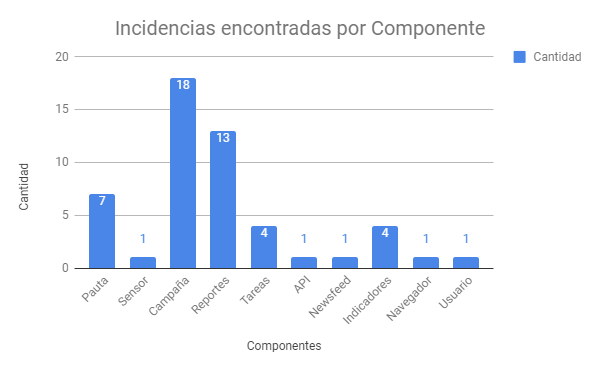
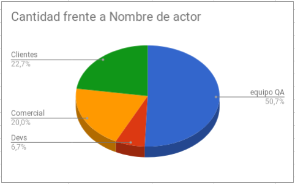
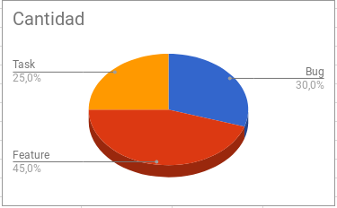

**Reporte QA QServus**

Viernes, 19 de Enero de 2018

**Introducción:**

En el siguiente documento se resumen los resultados de las actividades realizadas por el equipo de QA.
El equipo se ha dedicado a la revisión de tickets en qservus, además de reportar cualquier error que se haya podido encontrar en la plataforma, los cuales son registrados en un Documento de Errores, para luego ser revisados, validados y, los más relevantes entre ellos,  reportados por Francisco Cuadra.
Adicionalmente, un documento de Historias de Usuario (NOTE:  http://www.methodsandtools.com/archive/archive.php?id=72p2) se encuentra actualmente en progreso, el cual será utilizado como guía para todas las futuras pruebas.

El equipo está usando la herramienta Katalon (NOTE:  https://www.katalon.com/) para grabar y automatizar pruebas según el ya mencionado documento de Historias de Usuario.

A continuación se presentan cinco métricas derivadas del trabajo realizado desde el inicio del año 2018 hasta la fecha. Las métricas presentadas son:

1. **Incidencias Encontradas por Componente**: Refleja el número de incidencias halladas según el componente de la aplicación que afecta, como son pautas, sensores, campañas, etc. Este reporte incluye las incidencias escritas en el adjunto Reporte de Errores.

2. **Incidencias Encontradas según Actor:** Refleja la cantidad de incidencias encontradas en Qservus según el actor del sistema que las encontró, tales como equipo de QA, Desarrolladores, Equipo Comercial, Clientes. Este reporte incluye las incidencias escritas en el adjunto Reporte de Errores.

3. **Incidencias Reportadas por Tipo:** Refleja el tipo de incidencias que se reporta, tal como Bug, Task y Feature. Este reporte se limita a lo encontrado en Redmine.

4. **Tasa de Incidencias Resueltas:** Ilustra el flujo de trabajo realizado, calculado como el número de Incidencias Resueltas dividido por el número total de incidencias. Se cuentan todas las incidencias presentes a la fecha de 2 de Enero y posterior.

5. **Incidencias Resueltas por Tipo:** Número de incidencias resueltas dividido en Task, Bug y Feature.

**Semana** **: 15/01/18 - 19/01/18**

1.- **Incidencias Encontradas por Componente**

<table>
  <tr>
    <td>Componentes</td>
    <td>Cantidad</td>
  </tr>
  <tr>
    <td>Pauta</td>
    <td>7</td>
  </tr>
  <tr>
    <td>Sensor</td>
    <td>1</td>
  </tr>
  <tr>
    <td>Campaña</td>
    <td>18</td>
  </tr>
  <tr>
    <td>Reportes</td>
    <td>13</td>
  </tr>
  <tr>
    <td>Tareas</td>
    <td>4</td>
  </tr>
  <tr>
    <td>API</td>
    <td>1</td>
  </tr>
  <tr>
    <td>Newsfeed</td>
    <td>1</td>
  </tr>
  <tr>
    <td>Indicadores</td>
    <td>4</td>
  </tr>
  <tr>
    <td>Navegador</td>
    <td>1</td>
  </tr>
  <tr>
    <td>Usuario</td>
    <td>1</td>
  </tr>
  <tr>
    <td>Total</td>
    <td>51</td>
  </tr>
</table>

2.- **Incidencias Encontradas Reportadas según Actor**

<table>
  <tr>
    <td>Nombre de actor</td>
    <td>Cantidad</td>
  </tr>
  <tr>
    <td>Equipo QA</td>
    <td>38</td>
  </tr>
  <tr>
    <td>Devs</td>
    <td>5</td>
  </tr>
  <tr>
    <td>Comercial</td>
    <td>15</td>
  </tr>
  <tr>
    <td>Clientes</td>
    <td>17</td>
  </tr>
  <tr>
    <td>TOTAL</td>
    <td>75</td>
  </tr>
</table>

3.- **Incidencias Reportadas por Tipo**

<table>
  <tr>
    <td>TIPO</td>
    <td>Cantidad</td>
  </tr>
  <tr>
    <td>Bug</td>
    <td>12</td>
  </tr>
  <tr>
    <td>Feature</td>
    <td>18</td>
  </tr>
  <tr>
    <td>Task</td>
    <td>10</td>
  </tr>
  <tr>
    <td>Total</td>
    <td>40</td>
  </tr>
</table>

4.- **Tasa de Incidencias Resueltas**

<table>
  <tr>
    <td>N° Total Tickets Revisados que se Resueltos</td>
    <td>32</td>
  </tr>
  <tr>
    <td>N° Incidencias Totales</td>
    <td>64</td>
  </tr>
  <tr>
    <td>Tasa</td>
    <td>50,00%</td>
  </tr>
</table>

**N° Total de Tickets Resueltos:** Corresponde a la totalidad de ticket que se revisó por el equipo de QA.

**N° Incidencias Totales:** Corresponde a la cantidad total de tickets que han existido en la columna New e In Progress, además de las incidencias cerradas desde el 02/01/2018.

5.- **Incidencias Resueltas por Tipo**

<table>
  <tr>
    <td>N° Revisiones Totales</td>
    <td>52</td>
  </tr>
  <tr>
    <td>Bugs</td>
    <td>26</td>
  </tr>
  <tr>
    <td>Task</td>
    <td>3</td>
  </tr>
  <tr>
    <td>Feature</td>
    <td>3</td>
  </tr>
</table>

**N° de Revisiones Totales:** Corresponde a la cantidad de revisiones que se realizaron para la totalidad de ticket trabajados por el equipo de QA.